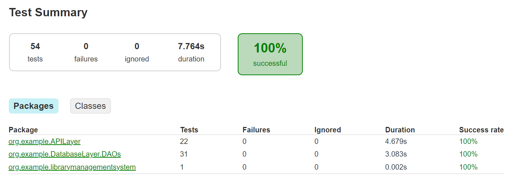
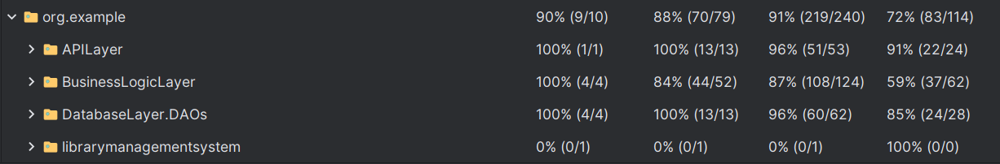
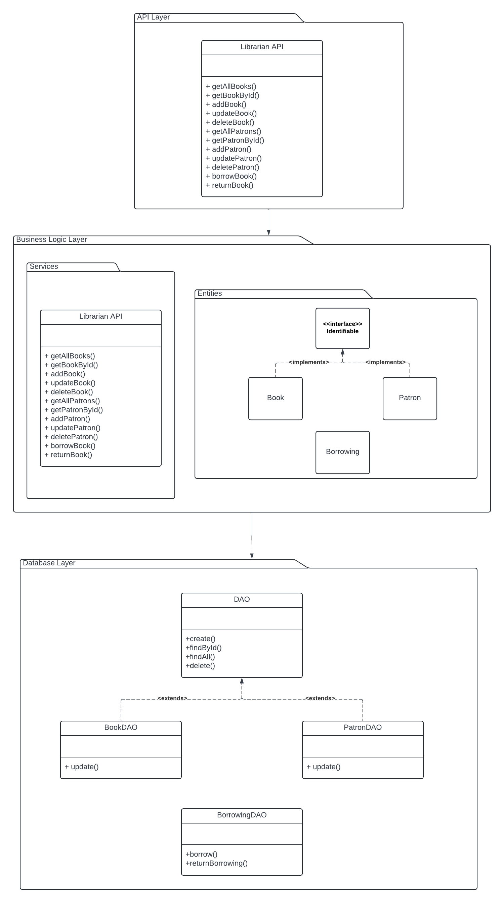

# Library Management System

This project implements a RESTful API for a library management system using Spring Boot. It provides endpoints for managing books and patrons, as well as functionality for borrowing and returning books.

## Getting Started
To get started with this project, follow these steps:

1. Clone the repository: git clone https://github.com/MariamAziz0/LibraryManagementSystem
2. Open the project in your preferred IDE.
3. Configure the database connection in application.properties.
4. Run the application.

# API Endpoints

## Books APIs
### Get all books

- **Method**: GET
- **URL**: http://localhost:8088/api/books

### Get a book by ID

- **Method**: GET
- **URL**: http://localhost:8088/api/books/{id}

### Add a new book

- **Method**: POST
- **URL**: http://localhost:8088/api/books
- **Body**:
  ```json
  {
      "title": "Book Title",
      "author": "Author Name",
      "isbn": "ISBN Number"
  }
  ```

### Update a book

- **Method**: PUT
- **URL**: http://localhost:8088/api/books/{id}
- **Body**:
  ```json
  {
      "title": "New Book Title",
      "author": "New Author Name",
      "isbn": "New ISBN Number"
  }
  ```

### Delete a book

- **Method**: DELETE
- **URL**: http://localhost:8088/api/books/{id}


## Patrons APIs

### Get all patrons

- **Method**: GET
- **URL**: http://localhost:8088/api/patrons

### Get a patron by ID

- **Method**: GET
- **URL**: http://localhost:8088/api/patrons/{id}

### Add a new patron

- **Method**: POST
- **URL**: http://localhost:8088/api/patrons
- **Body**:
  ```json
  {
      "name": "Patron Name",
      "mobile": "Patron Mobile"
  }
  ```

### Update a patron

- **Method**: PUT
- **URL**: http://localhost:8088/api/patrons/{id}
- **Body**:
  ```json
  {
      "name": "New Patron Name",
      "mobile": "Patron Mobile"
  }
  ```

### Delete a patron

- **Method**: DELETE
- **URL**: http://localhost:8088/api/patrons/{id}


## Borrowing APIs

### Borrow a book

- **Method**: POST
- **URL**: http://localhost:8088/api/borrow/{bookId}/patron/{patronId}

### Return a book

- **Method**: PUT
- **URL**: http://localhost:8088/api/borrow/{bookId}/patron/{patronId}

## Authentication
This API does not have authentication implemented for simplicity.

## Error Handling
The API handles errors gracefully and returns appropriate HTTP status codes.

## Conclusion
You should now be able to run the Library Management System API, interact with its endpoints, and manage books and patrons effectively. If you encounter any issues or have any questions, feel free to reach out.

---

# Attachments 

## TestCases with Coverage



## Class Diagram

